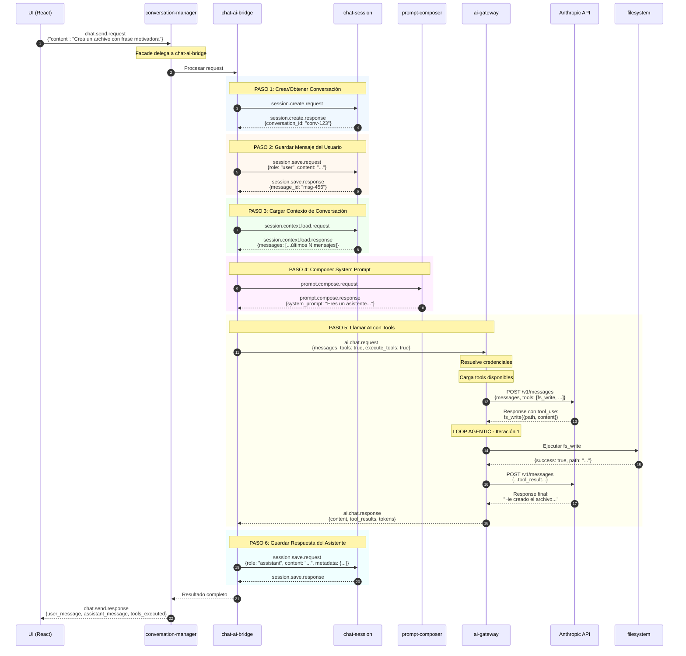
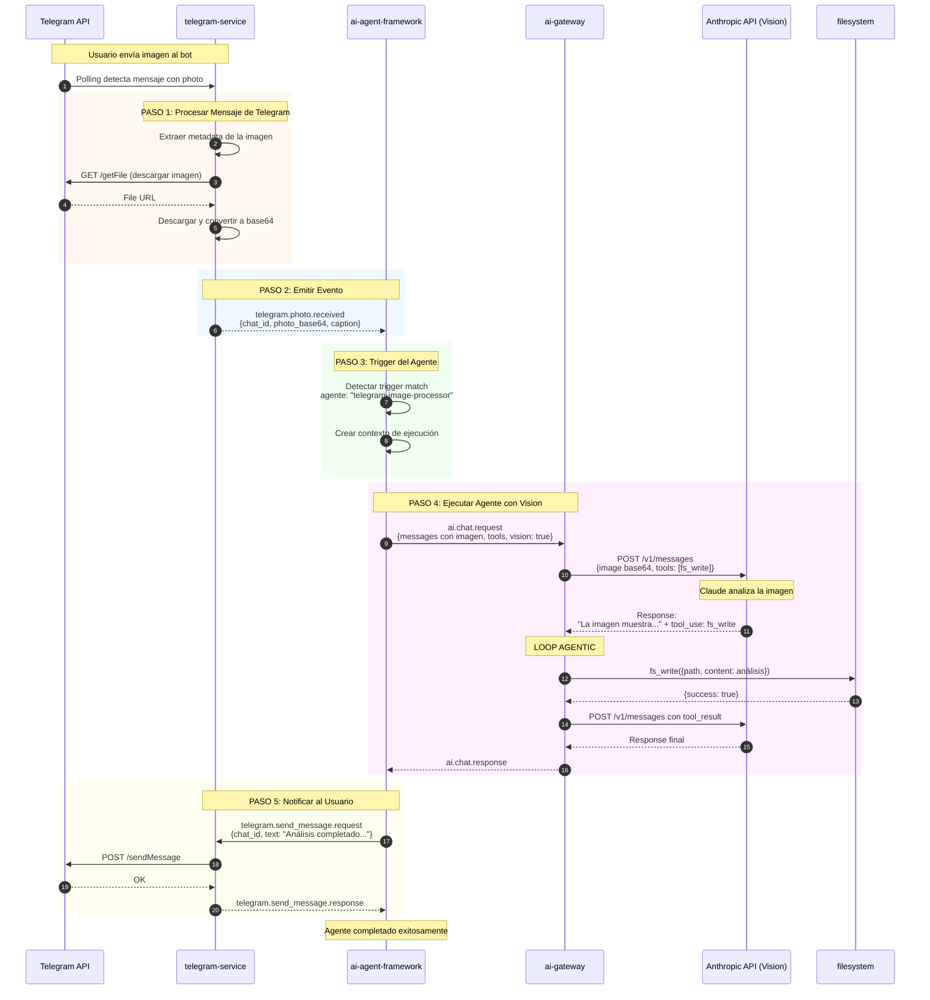
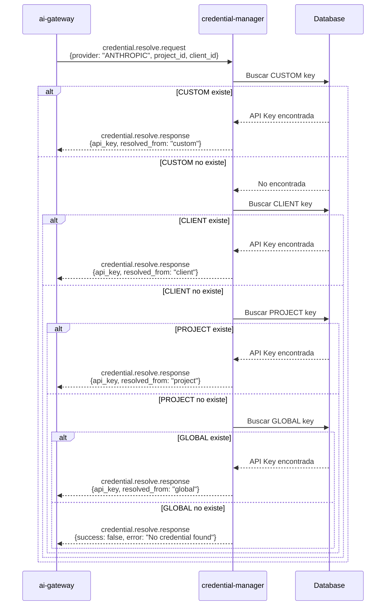

# Flujos Detallados del Sistema Event-Core

> Documentación exhaustiva de los flujos de ejecución del sistema event-driven.
>
> **Fecha**: 2026-01-07
> **Versión**: 2.0.0 (Post-Refactoring)

---

## Tabla de Contenidos

1. [Arquitectura General](#arquitectura-general)
2. [Flujo 1: Chat Crea Archivo con Frase Motivadora](#flujo-1-chat-crea-archivo-con-frase-motivadora)
3. [Flujo 2: Agente Procesa Imagen de Telegram](#flujo-2-agente-procesa-imagen-de-telegram)
4. [Estructura de Eventos](#estructura-de-eventos)
5. [Loop Agentic del AI-Gateway](#loop-agentic-del-ai-gateway)
6. [Sistema de Tools](#sistema-de-tools)
7. [Resolución de Credenciales](#resolución-de-credenciales)

---

## Arquitectura General

El sistema Event-Core sigue una arquitectura **event-driven** donde todos los módulos se comunican exclusivamente a través de eventos. No hay llamadas directas entre módulos.

### Componentes Principales

```
┌─────────────────────────────────────────────────────────────────────────┐
│                           EVENT BUS (MQTT)                               │
│                    core/{targetId}/events/{eventType}                    │
└─────────────────────────────────────────────────────────────────────────┘
       ▲         ▲         ▲         ▲         ▲         ▲         ▲
       │         │         │         │         │         │         │
  ┌────┴───┐ ┌───┴────┐ ┌──┴───┐ ┌───┴───┐ ┌───┴───┐ ┌───┴───┐ ┌───┴────┐
  │ conver │ │ chat   │ │ chat │ │prompt │ │  ai   │ │ tele  │ │  file  │
  │ sation │ │   ai   │ │ sess │ │compose│ │gateway│ │ gram  │ │ system │
  │ manager│ │ bridge │ │ ion  │ │   r   │ │       │ │service│ │        │
  └────────┘ └────────┘ └──────┘ └───────┘ └───────┘ └───────┘ └────────┘
       │                                        │
       │                                        │
       ▼                                        ▼
  ┌─────────┐                            ┌──────────────┐
  │   UI    │                            │   AI APIs    │
  │ (React) │                            │ (Anthropic,  │
  └─────────┘                            │  OpenAI...)  │
                                         └──────────────┘
```

### Módulos y Responsabilidades

| Módulo | Responsabilidad |
|--------|-----------------|
| `conversation-manager` | Facade para UI, delega a módulos especializados |
| `chat-ai-bridge` | Coordina flujo completo: save → compose → ai → save |
| `chat-session` | CRUD de conversaciones y mensajes, gestión de contexto FIFO |
| `prompt-composer` | Composición de system prompts con variables y contexto |
| `ai-gateway` | Cliente unificado a LLMs, ejecuta loop agentic con tools |
| `telegram-service` | Multi-bot Telegram, polling automático, eventos |
| `filesystem` | Operaciones de archivo, project-aware |
| `credential-manager` | Gestión centralizada de API keys con cascada |

---

## Flujo 1: Chat Crea Archivo con Frase Motivadora

### Escenario

> **Usuario en UI**: "Crea un archivo con una frase motivadora"

### Diagrama de Secuencia



### Detalle Paso a Paso

#### PASO 1: Recepción del Request (t=0ms)

```javascript
// UI envía evento
eventBus.emit('chat.send.request', {
  event_id: 'evt-001',
  event_type: 'chat.send.request',
  timestamp: '2026-01-07T12:00:00.000Z',
  source: { module_id: 'ui-handler' },
  data: {
    conversation_id: null,  // Nueva conversación
    content: 'Crea un archivo con una frase motivadora',
    project_id: 'proj-xyz'
  },
  trace: {
    trace_id: 'trace-abc',
    span_id: 'span-001'
  }
});
```

#### PASO 2: Crear Conversación (t=10ms)

```javascript
// chat-ai-bridge emite
eventBus.emit('session.create.request', {
  request_id: 'req-001',
  data: {
    project_id: 'proj-xyz',
    title: 'Nueva conversación',
    metadata: { source: 'ui' }
  }
});

// chat-session responde
eventBus.emit('session.create.response', {
  request_id: 'req-001',
  success: true,
  data: {
    conversation_id: 'conv-123',
    created_at: '2026-01-07T12:00:00.010Z'
  }
});
```

#### PASO 3: Guardar Mensaje del Usuario (t=20ms)

```javascript
// chat-ai-bridge emite
eventBus.emit('session.save.request', {
  request_id: 'req-002',
  data: {
    conversation_id: 'conv-123',
    role: 'user',
    content: 'Crea un archivo con una frase motivadora'
  }
});

// chat-session guarda en BD y aplica FIFO si necesario
// Responde con el mensaje guardado
eventBus.emit('session.save.response', {
  request_id: 'req-002',
  success: true,
  data: {
    message_id: 'msg-456',
    conversation_id: 'conv-123',
    role: 'user',
    content: 'Crea un archivo con una frase motivadora',
    in_context: 1,  // Incluido en contexto
    created_at: '2026-01-07T12:00:00.020Z'
  }
});
```

#### PASO 4: Cargar Contexto (t=30ms)

```javascript
// chat-ai-bridge solicita el contexto de la conversación
eventBus.emit('session.context.load.request', {
  request_id: 'req-003',
  data: {
    conversation_id: 'conv-123',
    max_messages: 50,  // Configurable
    include_system: false
  }
});

// chat-session retorna los mensajes con in_context=1
eventBus.emit('session.context.load.response', {
  request_id: 'req-003',
  success: true,
  data: {
    conversation_id: 'conv-123',
    messages: [
      {
        message_id: 'msg-456',
        role: 'user',
        content: 'Crea un archivo con una frase motivadora',
        created_at: '2026-01-07T12:00:00.020Z'
      }
    ],
    total_tokens_estimate: 12
  }
});
```

#### PASO 5: Componer System Prompt (t=40ms)

```javascript
// chat-ai-bridge solicita composición del prompt
eventBus.emit('prompt.compose.request', {
  request_id: 'req-004',
  data: {
    project_id: 'proj-xyz',
    template: 'default',
    variables: {
      date: '2026-01-07',
      user_name: 'Usuario'
    }
  }
});

// prompt-composer carga contexto del proyecto y compone
eventBus.emit('prompt.compose.response', {
  request_id: 'req-004',
  success: true,
  data: {
    system_prompt: `Eres un asistente inteligente para el proyecto "Mi Proyecto".

## Contexto del Proyecto
- Nombre: Mi Proyecto
- Descripción: Sistema de gestión de archivos

## Herramientas Disponibles
Tienes acceso a las siguientes herramientas:
- fs_write: Escribe contenido en un archivo
- fs_read: Lee el contenido de un archivo
- fs_list: Lista archivos en un directorio

## Instrucciones
- Responde de manera concisa y útil
- Usa las herramientas cuando sea necesario
- Siempre confirma las acciones realizadas`,
    tokens_estimate: 150
  }
});
```

#### PASO 6: Llamar AI con Tools (t=80ms - t=2000ms)

```javascript
// chat-ai-bridge envía request al ai-gateway
eventBus.emit('ai.chat.request', {
  request_id: 'req-005',
  data: {
    messages: [
      {
        role: 'system',
        content: '...[system prompt compuesto]...'
      },
      {
        role: 'user',
        content: 'Crea un archivo con una frase motivadora'
      }
    ],
    model: 'claude-3-5-sonnet-20241022',
    temperature: 0.7,
    max_tokens: 2048,
    tools: true,           // Habilitar tools
    execute_tools: true,   // Auto-ejecutar (loop agentic)
    project_id: 'proj-xyz'
  }
});
```

**Dentro del AI-Gateway - Loop Agentic:**

```javascript
// ITERACIÓN 1: Llamada inicial a Anthropic
const response1 = await anthropicProvider.chatCompletion(messages, {
  model: 'claude-3-5-sonnet-20241022',
  tools: [
    {
      name: 'fs_write',
      description: 'Escribe contenido en un archivo',
      input_schema: {
        type: 'object',
        properties: {
          path: { type: 'string', description: 'Ruta del archivo' },
          content: { type: 'string', description: 'Contenido a escribir' }
        },
        required: ['path', 'content']
      }
    }
  ]
});

// Respuesta de Anthropic con tool_use:
{
  content: [
    {
      type: 'text',
      text: 'Voy a crear un archivo con una frase motivadora para ti.'
    },
    {
      type: 'tool_use',
      id: 'toolu_01ABC',
      name: 'fs_write',
      input: {
        path: 'frase_motivadora.txt',
        content: 'El éxito no es la clave de la felicidad. La felicidad es la clave del éxito. Si amas lo que haces, tendrás éxito. - Albert Schweitzer'
      }
    }
  ],
  stop_reason: 'tool_use',
  usage: { input_tokens: 180, output_tokens: 95 }
}

// EJECUTAR TOOL
const toolResult = await moduleLoader.executeTool('fs_write', {
  path: 'frase_motivadora.txt',
  content: 'El éxito no es la clave de la felicidad...'
});

// Resultado:
{
  status: 'success',
  data: {
    success: true,
    path: '/data/projects/proj-xyz/storage/frase_motivadora.txt',
    size: 142,
    created_at: '2026-01-07T12:00:01.500Z'
  }
}

// Agregar a conversación para siguiente iteración
messages.push({
  role: 'assistant',
  content: response1.content
});

messages.push({
  role: 'user',
  content: [
    {
      type: 'tool_result',
      tool_use_id: 'toolu_01ABC',
      content: JSON.stringify({
        success: true,
        path: '/data/projects/proj-xyz/storage/frase_motivadora.txt',
        size: 142
      })
    }
  ]
});

// ITERACIÓN 2: Llamada con resultado del tool
const response2 = await anthropicProvider.chatCompletion(messages, options);

// Respuesta final sin tool_use:
{
  content: [
    {
      type: 'text',
      text: '¡Listo! He creado el archivo `frase_motivadora.txt` con una cita inspiradora de Albert Schweitzer sobre el éxito y la felicidad. El archivo se ha guardado en tu proyecto.'
    }
  ],
  stop_reason: 'end_turn',
  usage: { input_tokens: 320, output_tokens: 45 }
}

// FIN DEL LOOP - No más tool_use
```

#### PASO 7: Guardar Respuesta del Asistente (t=2010ms)

```javascript
// chat-ai-bridge guarda la respuesta
eventBus.emit('session.save.request', {
  request_id: 'req-006',
  data: {
    conversation_id: 'conv-123',
    role: 'assistant',
    content: '¡Listo! He creado el archivo `frase_motivadora.txt`...',
    metadata: {
      model: 'claude-3-5-sonnet-20241022',
      provider: 'anthropic',
      tokens: {
        input: 500,
        output: 140,
        total: 640
      },
      tool_calls: [
        {
          name: 'fs_write',
          status: 'success',
          path: 'frase_motivadora.txt'
        }
      ],
      iterations: 2,
      cost_usd: 0.0032
    }
  }
});
```

#### PASO 8: Respuesta Final a UI (t=2020ms)

```javascript
// conversation-manager retorna al UI
eventBus.emit('chat.send.response', {
  request_id: 'original-request-id',
  success: true,
  data: {
    conversation_id: 'conv-123',
    user_message: {
      message_id: 'msg-456',
      role: 'user',
      content: 'Crea un archivo con una frase motivadora',
      created_at: '2026-01-07T12:00:00.020Z'
    },
    assistant_message: {
      message_id: 'msg-457',
      role: 'assistant',
      content: '¡Listo! He creado el archivo...',
      created_at: '2026-01-07T12:00:02.010Z'
    },
    tokens_used: 640,
    cost_usd: 0.0032,
    tools_executed: [
      {
        name: 'fs_write',
        status: 'success',
        result: {
          path: '/data/projects/proj-xyz/storage/frase_motivadora.txt'
        }
      }
    ]
  }
});
```

### Archivo Creado

```
/data/projects/proj-xyz/storage/frase_motivadora.txt
```

**Contenido:**
```
El éxito no es la clave de la felicidad. La felicidad es la clave del éxito.
Si amas lo que haces, tendrás éxito. - Albert Schweitzer
```

---

## Flujo 2: Agente Procesa Imagen de Telegram

### Escenario

> **Usuario en Telegram**: Envía una imagen al bot
> **Agente AI**: Analiza la imagen automáticamente y crea un archivo con el análisis

### Diagrama de Secuencia



### Detalle Paso a Paso

#### PASO 1: Imagen Llega a Telegram (t=0ms)

El `telegram-service` está en modo polling, consultando la API de Telegram periódicamente.

```javascript
// telegram-service detecta nuevo mensaje
const update = {
  update_id: 123456789,
  message: {
    message_id: 42,
    from: {
      id: 987654321,
      is_bot: false,
      first_name: 'Juan',
      username: 'juanperez'
    },
    chat: {
      id: 987654321,
      type: 'private'
    },
    date: 1704628800,
    photo: [
      {
        file_id: 'AgACAgIAAxkBAAI..._small',
        file_unique_id: 'AQADAgAT_small',
        width: 90,
        height: 90,
        file_size: 1234
      },
      {
        file_id: 'AgACAgIAAxkBAAI..._medium',
        file_unique_id: 'AQADAgAT_medium',
        width: 320,
        height: 320,
        file_size: 12345
      },
      {
        file_id: 'AgACAgIAAxkBAAI..._large',  // Mejor calidad
        file_unique_id: 'AQADAgAT_large',
        width: 800,
        height: 800,
        file_size: 98765
      }
    ],
    caption: 'Documento importante para analizar'
  }
};
```

#### PASO 2: Descargar Imagen (t=100ms)

```javascript
// telegram-service selecciona la mejor calidad y descarga
const bestPhoto = update.message.photo[update.message.photo.length - 1];

// Obtener URL del archivo
const fileResponse = await fetch(
  `https://api.telegram.org/bot${token}/getFile?file_id=${bestPhoto.file_id}`
);
const fileData = await fileResponse.json();
// { ok: true, result: { file_id: "...", file_path: "photos/file_123.jpg" } }

// Descargar imagen
const imageUrl = `https://api.telegram.org/file/bot${token}/${fileData.result.file_path}`;
const imageBuffer = await fetch(imageUrl).then(r => r.arrayBuffer());
const imageBase64 = Buffer.from(imageBuffer).toString('base64');
```

#### PASO 3: Emitir Evento (t=500ms)

```javascript
// telegram-service emite evento al bus
eventBus.emit('telegram.photo.received', {
  event_id: 'evt-tg-001',
  event_type: 'telegram.photo.received',
  timestamp: '2026-01-07T12:00:00.500Z',
  source: {
    module_id: 'telegram-service',
    bot_name: 'mi_bot'
  },
  data: {
    bot_name: 'mi_bot',
    chat_id: 987654321,
    message_id: 42,
    from: {
      id: 987654321,
      first_name: 'Juan',
      username: 'juanperez'
    },
    photo: {
      file_id: 'AgACAgIAAxkBAAI..._large',
      width: 800,
      height: 800,
      file_size: 98765,
      base64: 'data:image/jpeg;base64,/9j/4AAQSkZJRg...',
      mime_type: 'image/jpeg'
    },
    caption: 'Documento importante para analizar',
    date: 1704628800
  },
  trace: {
    trace_id: 'trace-tg-001',
    span_id: 'span-001'
  }
});
```

#### PASO 4: Trigger del Agente (t=510ms)

El `ai-agent-framework` tiene configurado un agente que escucha este evento:

```json
{
  "name": "telegram-image-processor",
  "version": "1.0.0",
  "description": "Procesa imágenes de Telegram y crea análisis detallados",
  "enabled": true,
  "triggers": [
    {
      "event": "telegram.photo.received",
      "conditions": {
        "bot_name": "mi_bot"
      }
    }
  ],
  "config": {
    "model": "claude-3-5-sonnet-20241022",
    "vision_enabled": true,
    "tools": ["fs_write"],
    "max_iterations": 5,
    "auto_respond": true
  },
  "system_prompt": "Eres un experto analizador de imágenes. Cuando recibas una imagen:\n1. Analiza detalladamente su contenido\n2. Identifica elementos clave, texto, objetos, personas\n3. Guarda el análisis en un archivo markdown con nombre descriptivo\n4. Responde con un resumen del análisis"
}
```

```javascript
// ai-agent-framework detecta el trigger
const agent = agents.find(a =>
  a.triggers.some(t => t.event === 'telegram.photo.received')
);

// Crear contexto de ejecución
const executionContext = {
  execution_id: 'exec-001',
  agent_id: 'telegram-image-processor',
  trigger_event: event,
  status: 'running',
  started_at: '2026-01-07T12:00:00.510Z'
};
```

#### PASO 5: Llamar AI con Vision (t=520ms - t=3000ms)

```javascript
// ai-agent-framework prepara la llamada
const messages = [
  {
    role: 'user',
    content: [
      {
        type: 'image',
        source: {
          type: 'base64',
          media_type: 'image/jpeg',
          data: imageBase64  // Sin el prefijo data:image/jpeg;base64,
        }
      },
      {
        type: 'text',
        text: `Analiza esta imagen. Caption del usuario: "${caption}"`
      }
    ]
  }
];

// Emitir request al ai-gateway
eventBus.emit('ai.chat.request', {
  request_id: 'req-agent-001',
  data: {
    messages: messages,
    system: agent.system_prompt,
    model: 'claude-3-5-sonnet-20241022',
    tools: true,
    execute_tools: true,
    vision: true,
    context: {
      agent_id: 'telegram-image-processor',
      trigger: 'telegram.photo.received'
    }
  }
});
```

**Dentro del AI-Gateway - Llamada con Vision:**

```javascript
// Traducir a formato Anthropic
const anthropicRequest = {
  model: 'claude-3-5-sonnet-20241022',
  max_tokens: 4096,
  system: agent.system_prompt,
  messages: [
    {
      role: 'user',
      content: [
        {
          type: 'image',
          source: {
            type: 'base64',
            media_type: 'image/jpeg',
            data: imageBase64
          }
        },
        {
          type: 'text',
          text: 'Analiza esta imagen. Caption del usuario: "Documento importante para analizar"'
        }
      ]
    }
  ],
  tools: [
    {
      name: 'fs_write',
      description: 'Escribe contenido en un archivo',
      input_schema: {
        type: 'object',
        properties: {
          path: { type: 'string' },
          content: { type: 'string' }
        },
        required: ['path', 'content']
      }
    }
  ]
};

// Llamada a Anthropic
const response1 = await fetch('https://api.anthropic.com/v1/messages', {
  method: 'POST',
  headers: {
    'Content-Type': 'application/json',
    'x-api-key': apiKey,
    'anthropic-version': '2023-06-01'
  },
  body: JSON.stringify(anthropicRequest)
});
```

**Respuesta de Anthropic con análisis y tool_use:**

```json
{
  "content": [
    {
      "type": "text",
      "text": "He analizado la imagen detalladamente. Se trata de un documento que contiene información estructurada. Voy a guardar el análisis completo en un archivo."
    },
    {
      "type": "tool_use",
      "id": "toolu_vision_001",
      "name": "fs_write",
      "input": {
        "path": "analisis_imagen_20260107_120000.md",
        "content": "# Análisis de Imagen - 2026-01-07\n\n## Descripción General\nLa imagen muestra un documento con texto estructurado.\n\n## Elementos Identificados\n\n### Texto Detectado\n- Título principal visible en la parte superior\n- Varios párrafos de texto en español\n- Fecha visible: formato DD/MM/YYYY\n\n### Estructura del Documento\n- Encabezado con logo (esquina superior izquierda)\n- Cuerpo del documento con 3 secciones\n- Pie de página con información de contacto\n\n### Calidad de la Imagen\n- Resolución: 800x800 píxeles\n- Claridad: Alta, texto legible\n- Iluminación: Adecuada, sin sombras\n\n## Observaciones\n- El documento parece ser un informe o comunicado oficial\n- Contiene información que requiere atención\n- Se recomienda revisar el contenido original para detalles específicos\n\n## Metadata\n- Analizado: 2026-01-07 12:00:02 UTC\n- Fuente: Telegram (chat_id: 987654321)\n- Caption original: \"Documento importante para analizar\""
      }
    }
  ],
  "stop_reason": "tool_use",
  "usage": {
    "input_tokens": 1500,
    "output_tokens": 450
  }
}
```

**Ejecutar Tool fs_write:**

```javascript
// ai-gateway ejecuta el tool
const toolResult = await moduleLoader.executeTool('fs_write', {
  path: 'analisis_imagen_20260107_120000.md',
  content: '# Análisis de Imagen - 2026-01-07\n\n...'
});

// Resultado:
{
  status: 'success',
  data: {
    success: true,
    path: '/data/projects/active/storage/analisis_imagen_20260107_120000.md',
    size: 892,
    created_at: '2026-01-07T12:00:02.500Z'
  }
}
```

**Segunda iteración - Respuesta final:**

```javascript
// Agregar tool result y llamar de nuevo
messages.push({
  role: 'assistant',
  content: response1.content
});

messages.push({
  role: 'user',
  content: [
    {
      type: 'tool_result',
      tool_use_id: 'toolu_vision_001',
      content: JSON.stringify({ success: true, path: '...', size: 892 })
    }
  ]
});

// Segunda llamada
const response2 = await anthropicProvider.chatCompletion(messages, options);

// Respuesta final:
{
  "content": [
    {
      "type": "text",
      "text": "He completado el análisis de la imagen y guardado los resultados en el archivo `analisis_imagen_20260107_120000.md`.\n\n**Resumen del análisis:**\n- Tipo: Documento con texto estructurado\n- Calidad: Alta, texto legible\n- Contenido: Informe o comunicado oficial con 3 secciones\n\nEl archivo incluye detalles sobre los elementos identificados, la estructura del documento y observaciones relevantes."
    }
  ],
  "stop_reason": "end_turn",
  "usage": {
    "input_tokens": 2100,
    "output_tokens": 120
  }
}
```

#### PASO 6: Notificar al Usuario en Telegram (t=3100ms)

```javascript
// ai-agent-framework envía respuesta al usuario
eventBus.emit('telegram.send_message.request', {
  request_id: 'req-tg-send-001',
  data: {
    bot_name: 'mi_bot',
    chat_id: 987654321,
    text: `✅ *Análisis completado*\n\nHe analizado la imagen y guardado los resultados.\n\n*Resumen:*\n- Tipo: Documento con texto estructurado\n- Calidad: Alta, texto legible\n- Contenido: Informe o comunicado oficial\n\n📄 Archivo: \`analisis_imagen_20260107_120000.md\``,
    parse_mode: 'Markdown'
  }
});

// telegram-service procesa
const telegramResponse = await fetch(
  `https://api.telegram.org/bot${token}/sendMessage`,
  {
    method: 'POST',
    headers: { 'Content-Type': 'application/json' },
    body: JSON.stringify({
      chat_id: 987654321,
      text: '✅ *Análisis completado*\n\n...',
      parse_mode: 'Markdown'
    })
  }
);

// Emitir respuesta
eventBus.emit('telegram.send_message.response', {
  request_id: 'req-tg-send-001',
  success: true,
  data: {
    message_id: 43,
    chat_id: 987654321,
    sent_at: '2026-01-07T12:00:03.200Z'
  }
});
```

#### PASO 7: Agente Completado (t=3200ms)

```javascript
// ai-agent-framework emite evento de completado
eventBus.emit('agent.execution.completed', {
  event_id: 'evt-agent-complete-001',
  event_type: 'agent.execution.completed',
  timestamp: '2026-01-07T12:00:03.200Z',
  source: { module_id: 'ai-agent-framework' },
  data: {
    execution_id: 'exec-001',
    agent_id: 'telegram-image-processor',
    status: 'success',
    trigger_event: 'telegram.photo.received',
    duration_ms: 2700,
    iterations: 2,
    tokens_used: {
      input: 3600,
      output: 570,
      total: 4170
    },
    tools_executed: [
      {
        name: 'fs_write',
        status: 'success',
        path: 'analisis_imagen_20260107_120000.md'
      }
    ],
    files_created: [
      'analisis_imagen_20260107_120000.md'
    ],
    telegram_response_sent: true
  }
});
```

### Archivo Creado

```
/data/projects/active/storage/analisis_imagen_20260107_120000.md
```

**Contenido:**
```markdown
# Análisis de Imagen - 2026-01-07

## Descripción General
La imagen muestra un documento con texto estructurado.

## Elementos Identificados

### Texto Detectado
- Título principal visible en la parte superior
- Varios párrafos de texto en español
- Fecha visible: formato DD/MM/YYYY

### Estructura del Documento
- Encabezado con logo (esquina superior izquierda)
- Cuerpo del documento con 3 secciones
- Pie de página con información de contacto

### Calidad de la Imagen
- Resolución: 800x800 píxeles
- Claridad: Alta, texto legible
- Iluminación: Adecuada, sin sombras

## Observaciones
- El documento parece ser un informe o comunicado oficial
- Contiene información que requiere atención
- Se recomienda revisar el contenido original para detalles específicos

## Metadata
- Analizado: 2026-01-07 12:00:02 UTC
- Fuente: Telegram (chat_id: 987654321)
- Caption original: "Documento importante para analizar"
```

---

## Estructura de Eventos

### Event Envelope (Formato Estándar)

Todos los eventos del sistema siguen esta estructura:

```typescript
interface EventEnvelope {
  event_id: string;           // UUID v4 único
  event_type: string;         // "domain.action" ej: "chat.send.request"
  timestamp: string;          // ISO-8601 UTC
  source: {
    core_id?: string;         // ID del core emisor
    module_id: string;        // Módulo que emite
  };
  data: Record<string, any>;  // Payload específico del evento
  trace: {
    trace_id: string;         // W3C Trace Context
    span_id: string;
    parent_span_id?: string;
  };
  metadata?: Record<string, any>;  // Datos adicionales
}
```

### Patrones de Eventos

| Patrón | Ejemplo | Uso |
|--------|---------|-----|
| `*.request` | `session.save.request` | Solicitud de acción |
| `*.response` | `session.save.response` | Respuesta a solicitud |
| `*.created` | `session.created` | Notificación de creación |
| `*.updated` | `session.updated` | Notificación de cambio |
| `*.deleted` | `session.deleted` | Notificación de eliminación |
| `*.received` | `telegram.photo.received` | Dato externo recibido |
| `*.completed` | `agent.execution.completed` | Proceso finalizado |
| `*.failed` | `agent.execution.failed` | Error en proceso |

---

## Loop Agentic del AI-Gateway

### Diagrama del Loop

```
                    ┌─────────────────────────┐
                    │    INICIO DEL LOOP      │
                    │    iteration = 0        │
                    └───────────┬─────────────┘
                                │
                    ┌───────────▼─────────────┐
                    │   iteration < MAX (10)  │
                    │          ?              │
                    └───────────┬─────────────┘
                           YES  │  NO → SALIR
                    ┌───────────▼─────────────┐
                    │      iteration++        │
                    │   LLAMAR PROVIDER       │
                    │   (Anthropic/OpenAI)    │
                    └───────────┬─────────────┘
                                │
                    ┌───────────▼─────────────┐
                    │   ¿Respuesta tiene      │
                    │      tool_calls?        │
                    └───────────┬─────────────┘
                           YES  │  NO
                    ┌───────────▼───────┐     │
                    │  ¿execute_tools   │     │
                    │     = true?       │     │
                    └───────────┬───────┘     │
                           YES  │  NO         │
                    ┌───────────▼───────┐     │
                    │  EJECUTAR TOOLS   │     │
                    │  via moduleLoader │     │
                    └───────────┬───────┘     │
                                │             │
                    ┌───────────▼───────┐     │
                    │  Agregar a        │     │
                    │  conversación:    │     │
                    │  - assistant msg  │     │
                    │  - tool results   │     │
                    └───────────┬───────┘     │
                                │             │
                    ┌───────────▼─────────────▼─┐
                    │                           │
                    │  ←── CONTINUAR LOOP ───   │
                    │                           │
                    └───────────────────────────┘
                                │
                    ┌───────────▼─────────────┐
                    │    RETORNAR RESULTADO   │
                    │    {content, tokens,    │
                    │     tool_results, ...}  │
                    └─────────────────────────┘
```

### Código del Loop

```javascript
async function agenticLoop(messages, options) {
  const MAX_ITERATIONS = options.max_iterations || 10;
  let iteration = 0;
  let allToolResults = [];
  let totalTokens = { input: 0, output: 0 };
  let lastResponse = null;

  while (iteration < MAX_ITERATIONS) {
    iteration++;

    // 1. Llamar al provider
    const response = await provider.chatCompletion(messages, {
      model: options.model,
      temperature: options.temperature,
      max_tokens: options.max_tokens,
      tools: options.tools,
      system: options.system
    });

    lastResponse = response;
    totalTokens.input += response.usage.input_tokens;
    totalTokens.output += response.usage.output_tokens;

    // 2. Parsear tool calls
    const toolCalls = parseToolCalls(response);

    // 3. Sin tool calls = terminamos
    if (!toolCalls || toolCalls.length === 0) {
      break;
    }

    // 4. Si no auto-ejecutar, retornamos con los tool_calls
    if (!options.execute_tools) {
      return {
        content: extractContent(response),
        tool_calls: toolCalls,
        tokens: totalTokens,
        iterations: iteration
      };
    }

    // 5. Ejecutar cada tool
    const toolResults = [];
    for (const call of toolCalls) {
      try {
        const result = await moduleLoader.executeTool(
          call.name,
          call.arguments
        );
        toolResults.push({
          tool_call_id: call.id,
          name: call.name,
          status: 'success',
          result: result.data
        });
      } catch (error) {
        toolResults.push({
          tool_call_id: call.id,
          name: call.name,
          status: 'error',
          error: error.message
        });
      }
    }

    allToolResults.push(...toolResults);

    // 6. Agregar a conversación
    messages.push({
      role: 'assistant',
      content: response.content
    });

    // Formatear tool results según el provider
    const formattedResults = formatToolResults(toolResults, providerName);
    messages.push(...formattedResults);
  }

  // 7. Retornar resultado final
  return {
    content: extractContent(lastResponse),
    tool_results: allToolResults,
    tokens: totalTokens,
    iterations: iteration,
    model: options.model
  };
}
```

---

## Sistema de Tools

### Registro de Tools (module.json)

```json
{
  "name": "filesystem",
  "tools": [
    {
      "name": "fs_write",
      "description": "Escribe contenido en un archivo. Crea directorios si no existen.",
      "confirmation": false,
      "parameters": {
        "type": "object",
        "properties": {
          "path": {
            "type": "string",
            "description": "Ruta relativa del archivo"
          },
          "content": {
            "type": "string",
            "description": "Contenido a escribir"
          },
          "encoding": {
            "type": "string",
            "enum": ["utf-8", "base64", "binary"],
            "default": "utf-8"
          }
        },
        "required": ["path", "content"]
      }
    },
    {
      "name": "fs_read",
      "description": "Lee el contenido de un archivo",
      "confirmation": false,
      "parameters": {
        "type": "object",
        "properties": {
          "path": {
            "type": "string",
            "description": "Ruta del archivo a leer"
          }
        },
        "required": ["path"]
      }
    }
  ]
}
```

### Traducción entre Formatos

```javascript
// Formato interno (universal)
const internalTool = {
  name: 'fs_write',
  description: 'Escribe contenido en un archivo',
  parameters: {
    type: 'object',
    properties: { /* ... */ },
    required: ['path', 'content']
  }
};

// → Formato Anthropic
const anthropicTool = {
  name: 'fs_write',
  description: 'Escribe contenido en un archivo',
  input_schema: {
    type: 'object',
    properties: { /* ... */ },
    required: ['path', 'content']
  }
};

// → Formato OpenAI/DeepSeek
const openaiTool = {
  type: 'function',
  function: {
    name: 'fs_write',
    description: 'Escribe contenido en un archivo',
    parameters: {
      type: 'object',
      properties: { /* ... */ },
      required: ['path', 'content']
    }
  }
};
```

### Ejecución de Tools

```javascript
// moduleLoader.executeTool
async function executeTool(toolName, args) {
  // 1. Encontrar el módulo que provee el tool
  const module = findModuleByTool(toolName);
  if (!module) {
    throw new Error(`Tool not found: ${toolName}`);
  }

  // 2. Validar argumentos contra schema
  const toolDef = module.tools.find(t => t.name === toolName);
  const validation = validateArgs(args, toolDef.parameters);
  if (!validation.valid) {
    throw new Error(`Invalid arguments: ${validation.errors.join(', ')}`);
  }

  // 3. Verificar confirmación si requerida
  if (toolDef.confirmation) {
    // Emitir evento de confirmación pendiente
    // Esperar aprobación del usuario
  }

  // 4. Ejecutar la función del tool
  const handler = module.toolHandlers[toolName];
  const result = await handler(args);

  // 5. Emitir evento de ejecución
  eventBus.emit(`tool.${toolName}.executed`, {
    tool: toolName,
    args: args,
    result: result,
    timestamp: new Date().toISOString()
  });

  return {
    status: 'success',
    data: result
  };
}
```

---

## Resolución de Credenciales

### Cascada de Búsqueda

```
PRIORIDAD DE CREDENCIALES (de mayor a menor)

1. CUSTOM:  {PROVIDER}_API_KEY_CUSTOM_{customId}
   Ejemplo: ANTHROPIC_API_KEY_CUSTOM_cliente_especial

2. CLIENT:  {PROVIDER}_API_KEY_CLIENT_{clientId}
   Ejemplo: ANTHROPIC_API_KEY_CLIENT_acme_corp

3. PROJECT: {PROVIDER}_API_KEY_PROJECT_{projectId}
   Ejemplo: ANTHROPIC_API_KEY_PROJECT_proj_xyz

4. GLOBAL:  {PROVIDER}_API_KEY_GLOBAL
   Ejemplo: ANTHROPIC_API_KEY_GLOBAL
```

### Flujo de Resolución



---

## Resumen Comparativo de Flujos

| Aspecto | Flujo 1: Chat UI | Flujo 2: Telegram Agent |
|---------|------------------|-------------------------|
| **Trigger** | Usuario escribe en UI | Imagen llega al bot |
| **Entry Point** | `conversation-manager` | `telegram-service` |
| **Evento Inicial** | `chat.send.request` | `telegram.photo.received` |
| **Orquestador** | `chat-ai-bridge` | `ai-agent-framework` |
| **Vision** | No | Sí (imagen base64) |
| **Tools** | `fs_write` | `fs_write` |
| **Respuesta** | UI actualiza chat | Bot envía mensaje |
| **Persistencia** | En `chat-session` | Archivo en storage |
| **Iteraciones** | 2 (call + result) | 2 (call + result) |
| **Latencia Típica** | ~2 segundos | ~3 segundos |

---

## Conclusión

El sistema Event-Core implementa una arquitectura completamente event-driven donde:

1. **Desacoplamiento total**: Los módulos no se conocen entre sí, solo conocen eventos
2. **Escalabilidad**: Cada módulo puede escalarse independientemente
3. **Trazabilidad**: Todos los eventos llevan `trace_id` para seguimiento
4. **Flexibilidad**: Nuevos agentes y flujos se configuran, no se programan
5. **Loop Agentic**: El AI puede ejecutar múltiples herramientas iterativamente

Ambos flujos demuestran el poder de esta arquitectura:
- El chat UI utiliza la cadena de módulos especializados para máxima modularidad
- El agente Telegram muestra cómo triggers automáticos pueden ejecutar flujos complejos sin intervención humana
