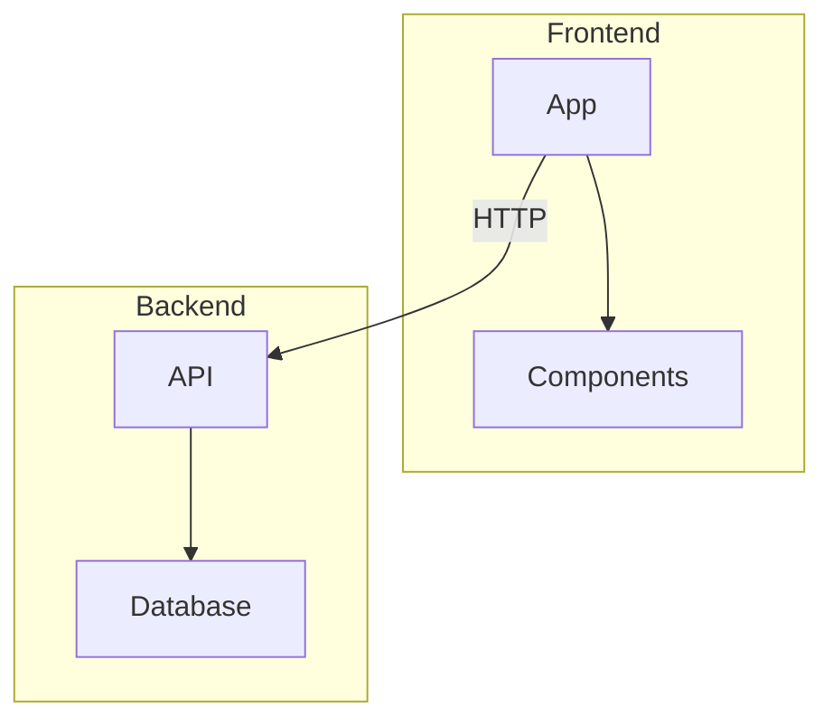

# Mermaid — referencia de sintaxis

Consultar cuando se genera cualquier diagrama. Los bloques se escriben en markdown con ` ```mermaid `.

---

## Flowchart

```
flowchart TD          %% TD = top-down, LR = left-right, RL, BT
    A[Rectangle]      %% [ ] = rectángulo
    B(Rounded)        %% ( ) = redondeado
    C{Diamond}        %% { } = diamante / decisión
    D[[Subroutine]]   %% [[ ]] = subrutina
    E[(Database)]     %% cilindro
    F((Circle))       %% (( )) = círculo
    G>Asymmetric]     %% bandera

    A --> B           %% flecha
    B --- C           %% línea sin flecha
    C -.-> D          %% flecha punteada
    D ==> E           %% flecha gruesa
    E --text--> F     %% flecha con texto
    F -->|label| G    %% texto alternativo
```

### Subgraphs



---

## Sequence Diagram

```
sequenceDiagram
    participant A as Alice
    participant B as Bob

    A->>B: Solid line with arrow
    A-->>B: Dotted line with arrow
    A-)B: Solid line, open arrow
    A--)B: Dotted line, open arrow

    activate B
    B->>A: Response
    deactivate B

    Note over A,B: Note spanning both
    Note right of A: Note on right

    alt Condition true
        A->>B: Do this
    else Condition false
        A->>B: Do that
    end

    loop Every minute
        A->>B: Ping
    end

    opt Optional
        A->>B: Maybe
    end
```

---

## Class Diagram

```
classDiagram
    class ClassName {
        +publicField
        -privateField
        #protectedField
        ~packageField
        +publicMethod()
        -privateMethod()
    }

    ClassA <|-- ClassB : Inheritance
    ClassC *-- ClassD : Composition
    ClassE o-- ClassF : Aggregation
    ClassG --> ClassH : Association
    ClassI ..> ClassJ : Dependency
    ClassK ..|> ClassL : Realization
```

---

## Entity Relationship (ER)

```
erDiagram
    USER ||--o{ ORDER : places
    ORDER ||--|{ LINE_ITEM : contains
    PRODUCT ||--o{ LINE_ITEM : "is in"

    USER {
        string id PK
        string email UK
        string name
    }
```

### Cardinalidad

```
||--||   uno a uno
||--o{   uno a cero-o-más
||--|{   uno a uno-o-más
}o--o{   cero-o-más a cero-o-más
```

---

## Gantt Chart

```
gantt
    title Timeline
    dateFormat YYYY-MM-DD

    section Planning
    Requirements    :a1, 2024-01-01, 7d
    Design          :a2, after a1, 14d

    section Development
    Backend         :b1, after a2, 21d
    Frontend        :b2, after a2, 28d

    section Launch
    Deploy          :milestone, after b2, 0d
```

---

## State Diagram

```
stateDiagram-v2
    [*] --> Idle
    Idle --> Processing: Submit
    Processing --> Success: Valid
    Processing --> Error: Invalid
    Success --> [*]
    Error --> Idle: Retry
```

---

## Pie Chart

```
pie title Market Share
    "Chrome" : 65
    "Safari" : 19
    "Firefox" : 10
    "Other" : 6
```

---

## Git Graph

```
gitGraph
    commit
    commit
    branch feature
    checkout feature
    commit
    commit
    checkout main
    merge feature
    commit
```

---

## User Journey

```
journey
    title Checkout Experience
    section Browse
        View products: 5: User
        Add to cart: 4: User
    section Pay
        Enter payment: 2: User
        Confirm: 5: User
    section Post
        Track shipment: 4: User, System
```

---

## Mindmap

```
mindmap
    root((Project))
        Frontend
            Framework
            Styles
        Backend
            API
            Database
        DevOps
            CI/CD
            Infra
```

---

## Styling

```
flowchart LR
    A[Start]:::green --> B[End]:::red

    classDef green fill:#22c55e,color:#fff
    classDef red fill:#ef4444,color:#fff
```

## Tips

- **Dirección:** `TD` (top-down), `LR` (left-right), `BT` (bottom-top), `RL` (right-left)
- **Comentarios:** `%%` para comentarios inline
- **Caracteres especiales:** usar comillas: `A["Label with (parens)"]`
- **Saltos de línea:** `<br/>` dentro de etiquetas
- **Temas:** `default`, `dark`, `forest`, `neutral`
