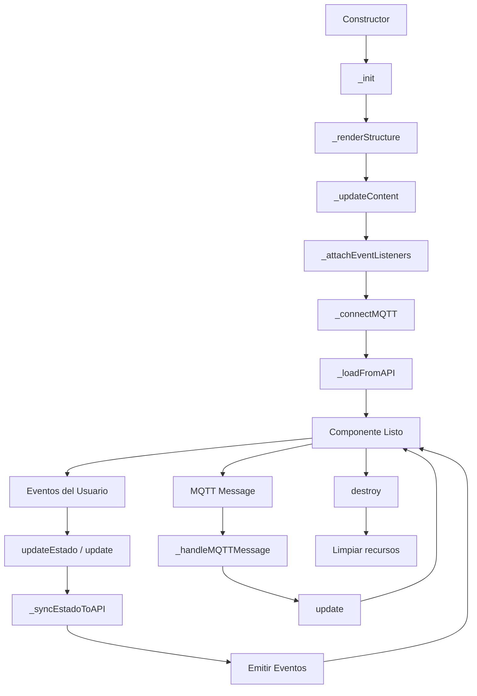

# 🎯 Cuenta Button Component

Botón de cuenta para sistemas POS/Comandero con estados visuales, actualización en tiempo real vía MQTT y gestos táctiles avanzados.

---

## 📋 Características

✅ **7 estados visuales** con marcos concéntricos y colores diferenciados
✅ **3 tipos de cuenta** con gradientes de fondo distintos
✅ **Actualización en tiempo real** vía MQTT pub/sub
✅ **Gestos táctiles** (click, long-press, touch zones)
✅ **Integración con APIs REST** de Event Core
✅ **Accesibilidad completa** (ARIA, teclado, lectores de pantalla)
✅ **Responsive design** (mobile-first)
✅ **Sistema de eventos** personalizable
✅ **JavaScript vanilla** (sin dependencias)

---

## 🎨 Estados

| Estado | Descripción | Colores | Emojis | Animación |
|--------|-------------|---------|--------|-----------|
| **pendiente** | Orden recibida, esperando cocina | Amarillo | 🕐 📋 👨‍🍳 ⏳ | - |
| **preparacion** | En cocina | Naranja | 🔥 👨‍🍳 ⏱️ 🍳 | - |
| **listo** | Listo para entregar | Verde | ✅ 🔔 👍 🎉 | Pulso verde |
| **entregado** | Entregado al cliente | Azul | ✅ 😊 🍽️ 👌 | - |
| **pagado** | Cuenta pagada | Verde esmeralda | 💰 ✅ 🧾 😊 | - |
| **problema** | Error o incidencia | Rojo | ⚠️ ❗ 🔴 ⚠️ | Pulso rojo |
| **cancelado** | Orden cancelada | Gris | ❌ 🚫 ⛔ ❌ | Opacidad 60% |

---

## 🍽️ Tipos de Cuenta

| Tipo | Descripción | Gradiente |
|------|-------------|-----------|
| **local** | Mesa en el local | Púrpura (#667eea → #764ba2) |
| **delivery** | Entrega a domicilio | Rosa-Rojo (#f093fb → #f5576c) |
| **llevar** | Para llevar | Azul (#4facfe → #00f2fe) |

---

## 📦 Instalación

### 1. Copiar archivos

```bash
cp -r ui-components/cuenta-button /tu-proyecto/components/
```

### 2. Incluir en HTML

```html
<!-- CSS -->
<link rel="stylesheet" href="components/cuenta-button/cuenta-button.css">

<!-- JavaScript -->
<script src="components/cuenta-button/cuenta-button.js"></script>

<!-- MQTT (opcional, solo si usas MQTT) -->
<script src="https://cdnjs.cloudflare.com/ajax/libs/paho-mqtt/1.0.1/mqttws31.min.js"></script>
```

---

## 🚀 Uso Básico

### HTML

```html
<button class="cuenta-button" id="mi-cuenta"></button>
```

### JavaScript

```javascript
// Obtener elemento
const element = document.getElementById('mi-cuenta');

// Inicializar componente
const cuentaBtn = new CuentaButton(element, {
  id: 'mesa-1',
  nombre: 'Mesa 1',
  tipo: 'local',
  estado: 'listo',
  total: 125.50,
  tiempo: 15
});
```

---

## ⚙️ Configuración

### Opciones del Constructor

```javascript
const cuentaBtn = new CuentaButton(element, {
  // ===== REQUERIDO =====
  id: 'mesa-1',              // ID único de la cuenta
  nombre: 'Mesa 1',           // Nombre visible
  tipo: 'local',              // 'local' | 'delivery' | 'llevar'
  estado: 'listo',            // Ver tabla de estados arriba

  // ===== OPCIONAL =====
  total: 125.50,              // Total de la cuenta (número)
  tiempo: 15,                 // Tiempo transcurrido en minutos (número)

  emojis: {                   // Emojis personalizados (por defecto según estado)
    topLeft: '🔥',
    topRight: '👨‍🍳',
    bottomLeft: '⏱️',
    bottomRight: '🍳'
  },

  config: {
    // API
    apiBaseUrl: 'http://localhost:3000/api',

    // MQTT
    enableMQTT: true,
    mqttUrl: 'ws://localhost:9001',

    // Gestos
    longPressDelay: 500       // Delay para long-press en ms
  }
});
```

---

## 📡 API REST

El componente integra automáticamente con las siguientes APIs de Event Core:

### GET `/api/ordenes/:id`

Obtiene los datos de la cuenta al inicializar.

**Response:**
```json
{
  "id": "mesa-1",
  "nombre": "Mesa 1",
  "tipo": "local",
  "estado": "listo",
  "total": 125.50,
  "tiempo": 15
}
```

### POST `/api/ordenes/:id/estado`

Actualiza el estado de la cuenta cuando se llama a `updateEstado()`.

**Request:**
```json
{
  "estado": "entregado"
}
```

**Response:**
```json
{
  "id": "mesa-1",
  "estado": "entregado",
  "timestamp": "2025-01-15T10:30:00Z"
}
```

---

## 📨 MQTT

El componente se suscribe automáticamente a los siguientes topics:

### `ordenes/:id/estado`

Actualización del estado en tiempo real.

**Payload:**
```json
{
  "estado": "listo",
  "timestamp": "2025-01-15T10:30:00Z"
}
```

### `ordenes/:id/update`

Actualización completa de datos.

**Payload:**
```json
{
  "nombre": "Mesa 1",
  "tipo": "local",
  "estado": "listo",
  "total": 150.00,
  "tiempo": 20
}
```

---

## 🎯 Eventos

El componente emite eventos personalizados que puedes escuchar:

### `action-comandero`

Se dispara al hacer click en la zona principal del botón (75% izquierdo).

```javascript
cuentaBtn.on('action-comandero', (data) => {
  console.log('Abrir comandero:', data);
  // { id: 'mesa-1', nombre: 'Mesa 1' }
});
```

### `action-cobro`

Se dispara al hacer click en el botón de cobro (esquina inferior derecha 💰).

```javascript
cuentaBtn.on('action-cobro', (data) => {
  console.log('Procesar cobro:', data);
  // { id: 'mesa-1', total: 125.50 }
});
```

### `state-change`

Se dispara cuando cambia el estado.

```javascript
cuentaBtn.on('state-change', (data) => {
  console.log('Estado cambió:', data);
  // { from: 'listo', to: 'entregado' }
});
```

### `long-press`

Se dispara al mantener presionado el botón (por defecto 500ms).

```javascript
cuentaBtn.on('long-press', (data) => {
  console.log('Long press detectado:', data);
  // { id: 'mesa-1' }
});
```

### `update`

Se dispara cuando se actualizan datos.

```javascript
cuentaBtn.on('update', (data) => {
  console.log('Datos actualizados:', data);
  // { total: 150.00, tiempo: 20 }
});
```

### `mqtt-update`

Se dispara al recibir un mensaje MQTT.

```javascript
cuentaBtn.on('mqtt-update', (data) => {
  console.log('Actualización MQTT:', data);
  // { topic: 'ordenes/mesa-1/estado', payload: {...} }
});
```

---

## 🔧 Métodos

### `updateEstado(nuevoEstado, options)`

Actualiza el estado del componente.

```javascript
await cuentaBtn.updateEstado('entregado');

// Con opciones
await cuentaBtn.updateEstado('pagado', {
  skipAPI: false,      // No enviar a API
  skipEmit: false,     // No emitir evento
  preserveEmojis: false // Mantener emojis actuales
});
```

**Returns:** `Promise<boolean>`

### `update(data, options)`

Actualiza múltiples propiedades.

```javascript
cuentaBtn.update({
  nombre: 'Mesa 1 - VIP',
  tipo: 'local',
  estado: 'listo',
  total: 200.00,
  tiempo: 25,
  emojis: {
    topLeft: '⭐',
    topRight: '👑'
  }
});
```

### `setLoading(loading)`

Muestra/oculta el estado de carga.

```javascript
cuentaBtn.setLoading(true);  // Mostrar spinner
cuentaBtn.setLoading(false); // Ocultar spinner
```

### `getState()`

Obtiene el estado actual.

```javascript
const state = cuentaBtn.getState();
console.log(state);
// {
//   id: 'mesa-1',
//   nombre: 'Mesa 1',
//   tipo: 'local',
//   estado: 'listo',
//   total: 125.50,
//   tiempo: 15,
//   emojis: {...},
//   loading: false
// }
```

### `on(event, callback)`

Registra un event listener.

```javascript
const handler = (data) => console.log(data);
cuentaBtn.on('state-change', handler);
```

### `off(event, callback)`

Elimina un event listener.

```javascript
cuentaBtn.off('state-change', handler); // Eliminar específico
cuentaBtn.off('state-change');          // Eliminar todos
```

### `emit(event, data)`

Emite un evento personalizado.

```javascript
cuentaBtn.emit('custom-event', { foo: 'bar' });
```

### `destroy()`

Destruye el componente y libera recursos.

```javascript
cuentaBtn.destroy();
```

---

## 🎨 Personalización CSS

### Variables CSS Disponibles

```css
:root {
  /* Dimensiones */
  --cuenta-button-width: 151px;
  --cuenta-button-height: 113px;
  --cuenta-button-border-radius: 8px;

  /* Marcos */
  --cuenta-button-marco-thickness: 3px;
  --cuenta-button-marco-exterior-inset: 0px;
  --cuenta-button-marco-medio-inset: 6px;
  --cuenta-button-marco-interior-inset: 12px;
  --cuenta-button-centro-inset: 18px;

  /* Esquinas */
  --cuenta-button-corner-size: 24px;
  --cuenta-button-corner-offset: 4px;

  /* Tipografía */
  --cuenta-button-font-family: -apple-system, BlinkMacSystemFont, 'Segoe UI', sans-serif;
  --cuenta-button-nombre-size: 14px;
  --cuenta-button-meta-size: 11px;

  /* Transiciones */
  --cuenta-button-transition: all 0.3s ease;
  --cuenta-button-transition-fast: all 0.15s ease;

  /* Colores */
  --cuenta-button-text: #ffffff;
  --cuenta-button-text-dark: #1f2937;
  --cuenta-button-shadow: rgba(0, 0, 0, 0.1);
}
```

### Ejemplo de Personalización

```css
/* Botones más grandes */
.cuenta-button {
  --cuenta-button-width: 200px;
  --cuenta-button-height: 150px;
}

/* Marcos más gruesos */
.cuenta-button {
  --cuenta-button-marco-thickness: 5px;
}

/* Sin animaciones */
.cuenta-button {
  --cuenta-button-transition: none;
}

/* Gradiente personalizado para tipo "local" */
.cuenta-button[data-tipo="local"] .cuenta-button__centro {
  background: linear-gradient(135deg, #ff6b6b 0%, #ee5a24 100%);
}
```

---

## ♿ Accesibilidad

- ✅ **ARIA labels** para lectores de pantalla
- ✅ **Navegación por teclado** (Enter/Espacio)
- ✅ **Focus visible** con outline personalizado
- ✅ **Alto contraste** con `@media (prefers-contrast: high)`
- ✅ **Reducción de movimiento** con `@media (prefers-reduced-motion: reduce)`
- ✅ **Información semántica** oculta visualmente pero accesible

---

## 📱 Responsive

### Breakpoints

```css
/* Mobile (< 768px) */
@media (max-width: 768px) {
  min-width: 140px;
  min-height: 90px;
  font-size: 13px;
}

/* Desktop (> 1024px) */
@media (min-width: 1024px) {
  width: 180px;
  height: 130px;
  font-size: 16px;
}
```

---

## 🧪 Testing

### Ejemplo con Jest

```javascript
describe('CuentaButton', () => {
  let element, component;

  beforeEach(() => {
    element = document.createElement('button');
    document.body.appendChild(element);

    component = new CuentaButton(element, {
      id: 'test-1',
      nombre: 'Test',
      tipo: 'local',
      estado: 'pendiente'
    });
  });

  afterEach(() => {
    component.destroy();
    document.body.removeChild(element);
  });

  test('debe inicializar correctamente', () => {
    expect(component.id).toBe('test-1');
    expect(component.estado).toBe('pendiente');
  });

  test('debe actualizar estado', async () => {
    await component.updateEstado('listo');
    expect(component.estado).toBe('listo');
  });

  test('debe emitir eventos', (done) => {
    component.on('state-change', (data) => {
      expect(data.to).toBe('listo');
      done();
    });

    component.updateEstado('listo', { skipAPI: true });
  });
});
```

---

## 🎯 Ejemplos de Uso

### Ejemplo 1: Comandero Simple

```javascript
const cuentaBtn = new CuentaButton(element, {
  id: 'mesa-5',
  nombre: 'Mesa 5',
  tipo: 'local',
  estado: 'listo',
  total: 85.00,
  tiempo: 12
});

// Abrir comandero al hacer click
cuentaBtn.on('action-comandero', ({ id }) => {
  window.location.href = `/comandero?orden=${id}`;
});

// Procesar cobro
cuentaBtn.on('action-cobro', ({ id, total }) => {
  abrirModalCobro(id, total);
});
```

### Ejemplo 2: Dashboard con MQTT

```javascript
// Crear grid de cuentas
const cuentas = ['mesa-1', 'mesa-2', 'mesa-3', 'delivery-1', 'llevar-1'];

cuentas.forEach(id => {
  const element = document.createElement('button');
  element.className = 'cuenta-button';
  document.querySelector('.grid').appendChild(element);

  const component = new CuentaButton(element, {
    id,
    nombre: id.replace('-', ' ').toUpperCase(),
    tipo: id.includes('delivery') ? 'delivery' : id.includes('llevar') ? 'llevar' : 'local',
    estado: 'pendiente',
    config: {
      enableMQTT: true,
      mqttUrl: 'ws://localhost:9001'
    }
  });

  // Las actualizaciones vienen automáticamente vía MQTT
});
```

### Ejemplo 3: Actualización Manual

```javascript
const cuentaBtn = new CuentaButton(element, {
  id: 'mesa-10',
  nombre: 'Mesa 10',
  tipo: 'local',
  estado: 'preparacion',
  config: {
    enableMQTT: false // Sin MQTT
  }
});

// Simular progreso de la orden
setTimeout(() => cuentaBtn.updateEstado('listo'), 5000);
setTimeout(() => cuentaBtn.updateEstado('entregado'), 10000);
setTimeout(() => cuentaBtn.updateEstado('pagado'), 15000);

// Actualizar tiempo cada minuto
setInterval(() => {
  cuentaBtn.update({ tiempo: cuentaBtn.tiempo + 1 });
}, 60000);
```

---

## 📂 Estructura de Archivos

```
cuenta-button/
├── component.json           # Especificación JSON del componente
├── cuenta-button.html        # Template HTML (referencia)
├── cuenta-button.css         # Estilos completos (506 líneas)
├── cuenta-button.js          # JavaScript vanilla (700+ líneas)
├── README.md                 # Esta documentación
└── examples/
    └── index.html            # Ejemplos interactivos
```

---

## 🔄 Ciclo de Vida



---

## 🐛 Troubleshooting

### El componente no se inicializa

```javascript
// ❌ Malo
const element = null;
const cuentaBtn = new CuentaButton(element, {...});

// ✅ Bueno
const element = document.querySelector('.cuenta-button');
if (element) {
  const cuentaBtn = new CuentaButton(element, {...});
}
```

### MQTT no conecta

```javascript
// Verifica que Paho MQTT esté cargado
if (typeof Paho === 'undefined') {
  console.error('Paho MQTT no disponible');
}

// Usa el formato correcto de URL
config: {
  mqttUrl: 'ws://localhost:9001' // ✅ Correcto
  // mqttUrl: 'http://localhost:9001' // ❌ Incorrecto
}
```

### Los eventos no se disparan

```javascript
// ❌ Malo - Registrar después de la acción
cuentaBtn.updateEstado('listo');
cuentaBtn.on('state-change', handler); // Muy tarde

// ✅ Bueno - Registrar antes
cuentaBtn.on('state-change', handler);
cuentaBtn.updateEstado('listo');
```

---

## 📊 Performance

- **Tamaño CSS:** ~15 KB (minificado: ~10 KB)
- **Tamaño JS:** ~25 KB (minificado: ~15 KB)
- **Primera renderización:** < 10ms
- **Actualización de estado:** < 5ms
- **Consumo MQTT:** ~1 KB/mensaje

---

## 🔮 Roadmap

- [ ] Soporte para temas personalizados
- [ ] Modo compacto para pantallas pequeñas
- [ ] Animaciones de transición entre estados
- [ ] Soporte para drag & drop
- [ ] Notificaciones push
- [ ] Modo offline con LocalStorage
- [ ] Integración con Web Workers

---

## 📄 Licencia

Misma licencia que Event Core.

---

## 👥 Contribuir

Para agregar mejoras o reportar bugs:

1. Fork del repositorio
2. Crear rama de feature (`git checkout -b feature/mejora`)
3. Commit de cambios (`git commit -m 'Add: nueva funcionalidad'`)
4. Push a la rama (`git push origin feature/mejora`)
5. Abrir Pull Request

---

## 🙏 Créditos

**Creado con:** Prompt Maestro de Componentes UI
**Versión:** 1.0.0
**Fecha:** 2025-01-15
**Autor:** Event Core Team

---

**¿Necesitas ayuda?** Abre un issue en el repositorio o consulta la documentación de Event Core.

🚀 **¡Happy coding!**
